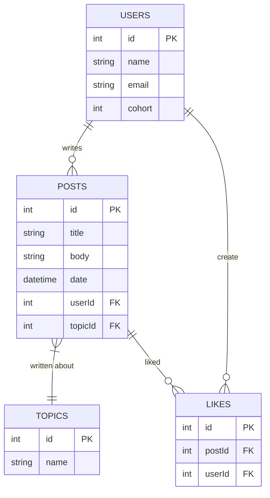

```mermaid
erDiagram
    USERS ||--o{ POSTS : "writes"
    USERS ||--o{ LIKES : "create"
    POSTS }|--|| TOPICS : "written about"
    POSTS ||--o{ LIKES : "liked"

    
    

    USERS {
         int id PK
         string name
         string email
         int cohort

    }
    POSTS {
        int id PK
        string title
        string body
        datetime date
        int userId FK
        int topicId FK
    }

    TOPICS {
        int id PK
        string name
    }

    LIKES {
        int id PK
        int postId FK
        int userId FK
    }
```
